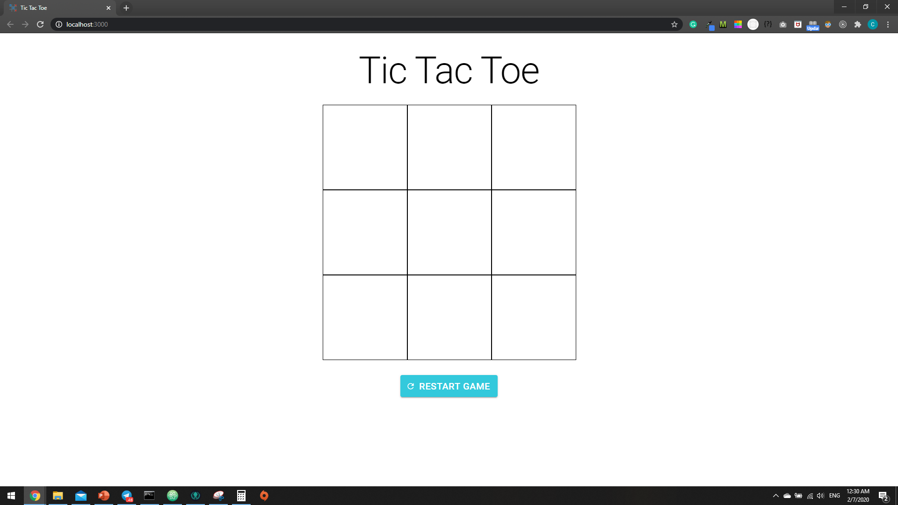
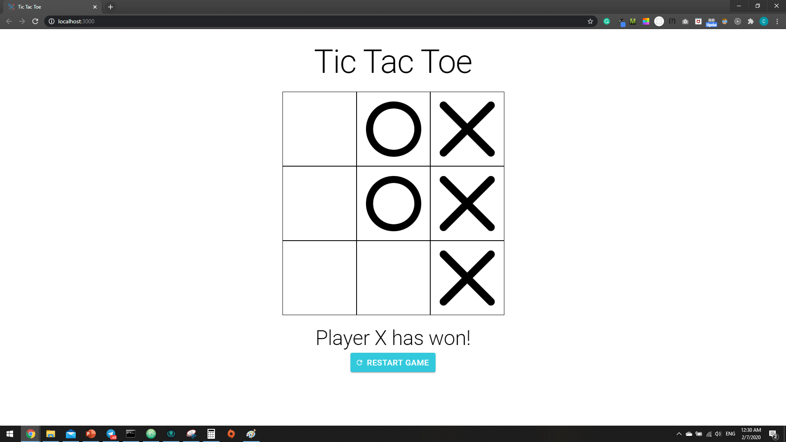
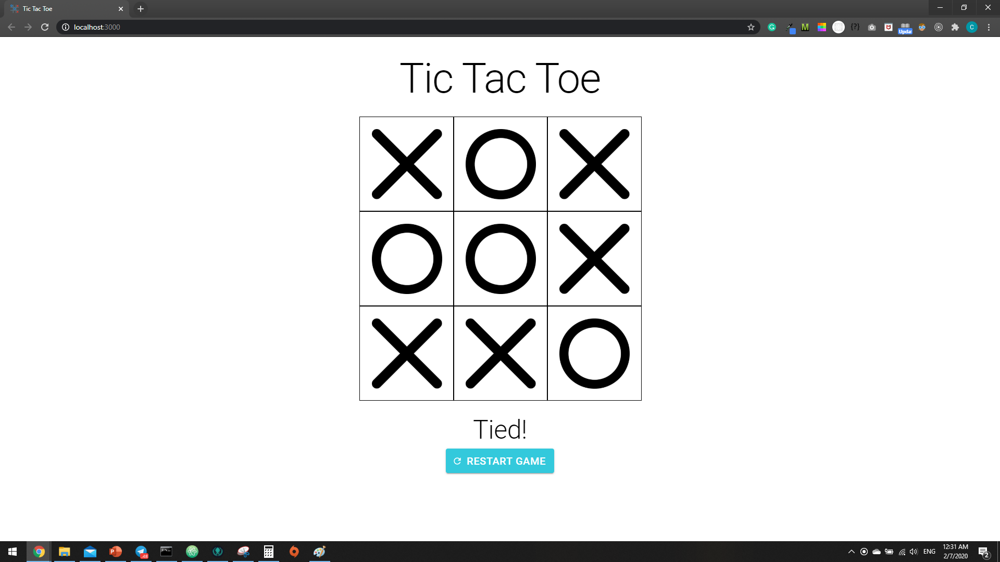

# Tic Tac Toe

Responsive Tic Tac Toe program, bootstrapped using create-react-app and MaterialUI

----------------------------------

### Instructions
1. Clone the repository
2. Using ```cmd``` and change the directory to the repository
3. Install npm using ```npm install```
4. Start the program using ```npm start```
5. Access the program via ```http://localhost:3000/``` from your browser

### Features
1. Player X always starts first
2. Restart capability

### Improvements
1. Lobby-system - allowing players to join room and play remotely by sharing Room ID

### Images







--------------------


